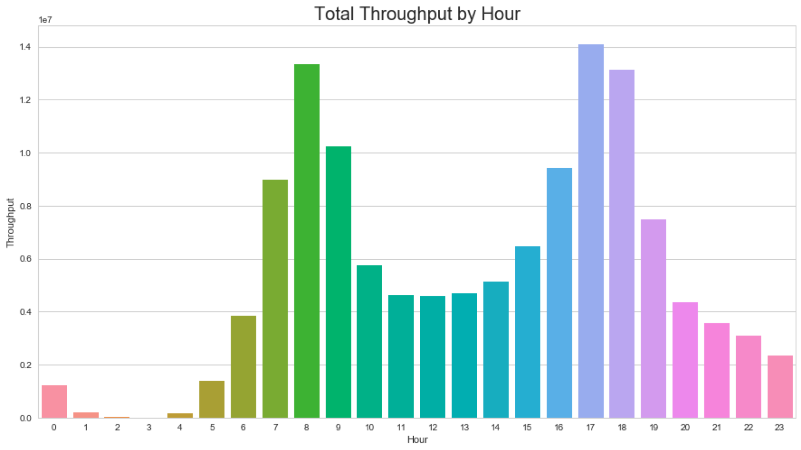
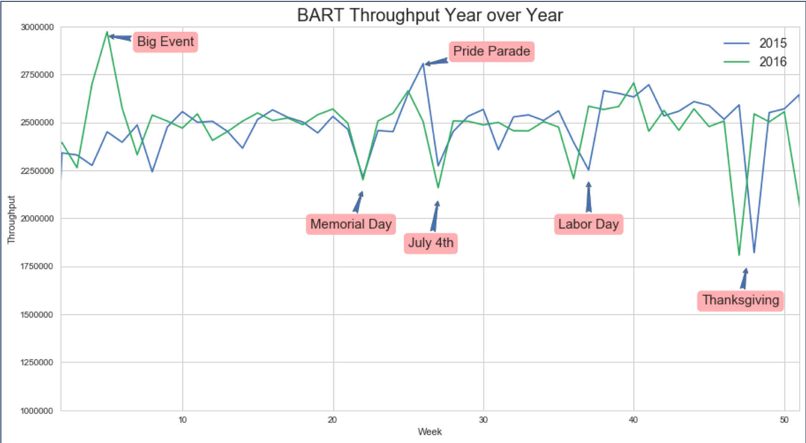
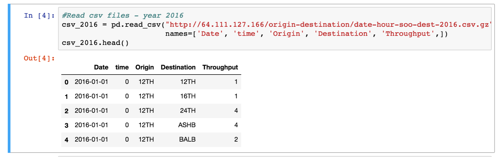

# BRANCH 4
**UC Berkeley Extension Data Analytics**

* Group Project 1: BART Ridership Data 

Questions addressed by the team:
- Hourly trends – when should I ride Bart if I don’t want a crowded train?

Note: This is aggregate data for one full year, 2016 total throughput.

- What are the ridership yearly trends? What does the seasonality look like?

**Code Key Learnings**

- When utilizing Pandas to read csv files there is no need to download a large CSV file if a link to it is already available. BART.gov already hosts the data on their site:

